## Tarefa 1.6. 1.6 logs + utilidade rndc + nsupdate

1. Fai que no equipo darthvader se faga un log de todas as consultas (/var/log/bind/queries.log) e de todas as actualizacions (/var/log/bind/update.log) a dous ficheiros de log diferentes. Captura a configuración. Amosa as capturas dos dous ficheiros de log, despois de facer consultas e actualizacións e transferencias de zona.

    - Modificación do ficheiro named.conf.local

        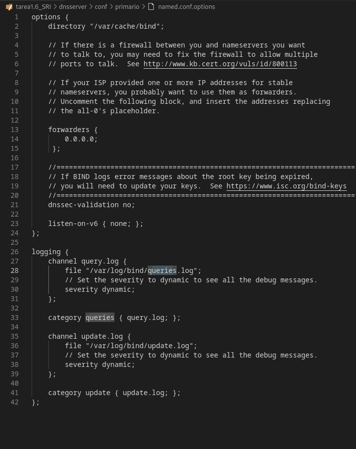

    - Cambiar o usuario propietario do ficheiro /var/log/named/query.log:

        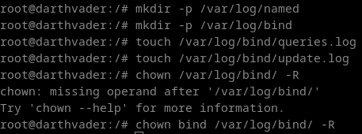

    - Realizamos varias consultas:

        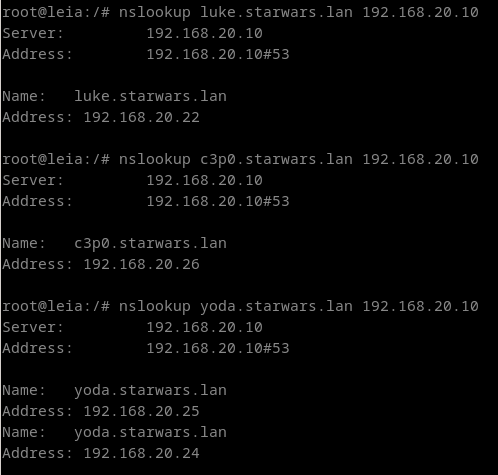

    - Comprobamos os ficheiros de log:

        - /var/log/bind/queries.log:

            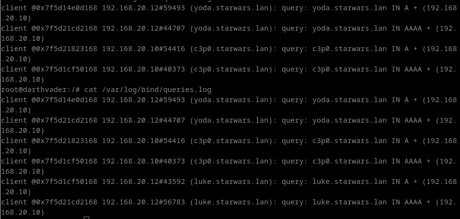

2. Investiga como co comando "dig" podes pedir unha copia dunha zona.

    - Transferencia de zona usando dig

        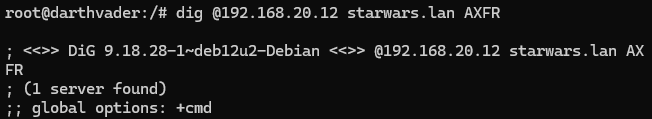

3. Permite que o equipo darthvader poida ser controlado coa utilidade rndc desde un cliente ubuntu ou debian. Fai unha captura do servidor reiniciandose.

    - Creación da clave TSIG

        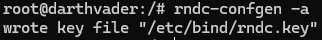

    - Verificamos o contido do arquivo

        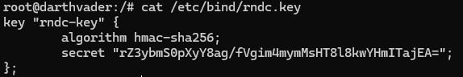

    - Modificación ficheiro named.conf.options

        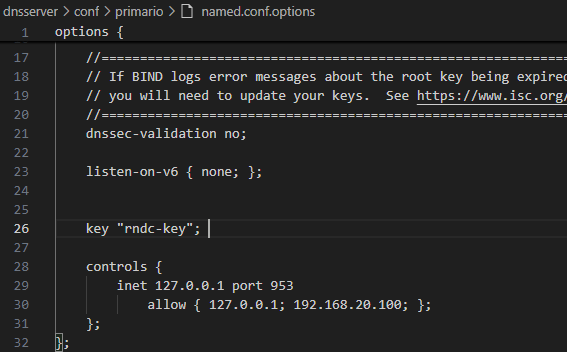

    - Creación do ficheiro rndc.conf no cliente

        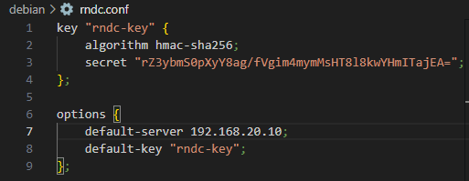

    - Reiniciamos servizo e acedemos dende cliente

4. Instala unha zona dinámica no servidor darthvader chamada galaxia.lan e introduce os rexistros aaylasecura (192.168.20.239) e yarua (192.168.20.238). Esta zona debe ser cargada mediante rndc, e o servidor reiniciado con rndc. Proba tamén a eliminala con rndc. Inclue capturas do resultado dos comandos, comprobando tamén que se poden facer consultas.

    - rndc.conf do cliente:

        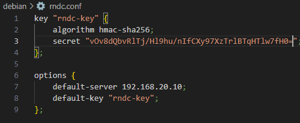

    - rndc.key do servidor:

        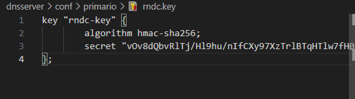

    - Definimos a zona galaxia.lan no named.conf.local do servidor

        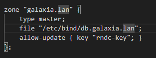

    - Creamos a zona db.galaxia.lan

        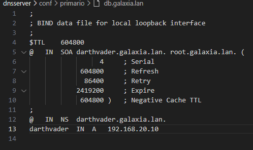
    
    - Comprobamos que se engadiron os rexistros

        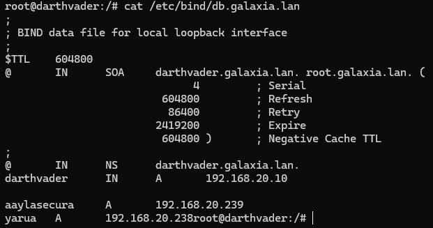
    
5. Mediante a utilidade nsupdate, engade un rexistro chamado darthmaul (192.168.20.144) á zona starwars.lan empregando chaves

    - Engadimos o rexistro empregando nsupdate

        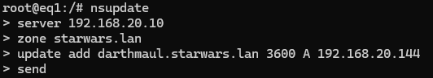

    - Comprobamos a existencia do rexistro na zona

        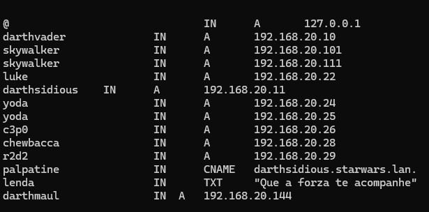